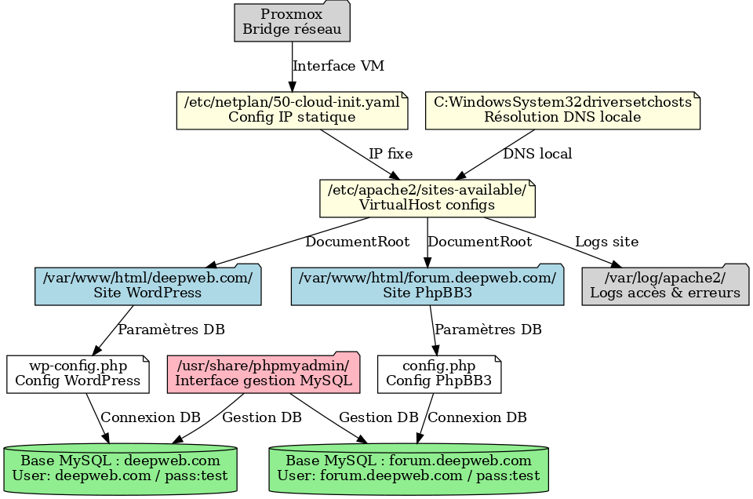

# Documentation du serveur LAMP

## Qu’est-ce qu’un serveur LAMP et son utilité ?

Un **serveur LAMP** est une pile logicielle composée de :  
- **Linux** : le système d’exploitation.  
- **Apache** : le serveur web qui gère et sert les pages aux utilisateurs.  
- **MySQL/MariaDB** : le système de gestion de bases de données relationnelles.  
- **PHP** : le langage de programmation côté serveur qui permet de générer des pages dynamiques.  

Cette architecture est largement utilisée car elle est **open source, stable et flexible**.  
Elle permet d’héberger des sites dynamiques tels que **WordPress, PhpBB3, Joomla, Drupal**, ainsi que des applications web personnalisées.  
Dans ce projet, le serveur LAMP est utilisé pour héberger :  
- Un site WordPress (`deepweb.com`)  
- Un forum PhpBB3 (`forum.deepweb.com`)  

---

# Documentation des fichiers et dossiers du serveur LAMP

Cette documentation récapitule les fichiers et dossiers créés/configurés pour la mise en place complète du serveur LAMP avec WordPress et PhpBB3.

---

## 1) Répertoires Web

### `/var/www/html/deepweb.com/`
- **Contenu** : Fichiers WordPress.  
- **Utilité** : Héberge le site WordPress accessible via `http://deepweb.com`.  
- **Permissions** : Propriétaire `www-data`, droits 755 pour les répertoires, 644 pour les fichiers.

### `/var/www/html/forum.deepweb.com/`
- **Contenu** : Fichiers PhpBB3 (forum).  
- **Utilité** : Héberge le forum PhpBB3 accessible via `http://forum.deepweb.com`.  
- **Permissions** : Propriétaire `www-data`, droits 755 pour les répertoires, 644 pour les fichiers.

---

## 2) Fichiers Apache

### `/etc/apache2/sites-available/deepweb.com.conf`
- **Contenu** : VirtualHost pour `deepweb.com`.  
- **Utilité** : Définit le DocumentRoot, autorise `.htaccess`, et configure logs dédiés.  
- **Lien** : Activé par `a2ensite deepweb.com.conf`.

### `/etc/apache2/sites-available/forum.deepweb.com.conf`
- **Contenu** : VirtualHost pour `forum.deepweb.com`.  
- **Utilité** : Définit le DocumentRoot, autorise `.htaccess`, et configure logs dédiés.  
- **Lien** : Activé par `a2ensite forum.deepweb.com.conf`.

### Logs Apache
- `/var/log/apache2/deepweb.com_error.log` : Erreurs du site WordPress.  
- `/var/log/apache2/deepweb.com_access.log` : Accès au site WordPress.  
- `/var/log/apache2/forum.deepweb.com_error.log` : Erreurs du forum PhpBB3.  
- `/var/log/apache2/forum.deepweb.com_access.log` : Accès au forum PhpBB3.

---

## 3) Fichiers spécifiques aux applications

### WordPress
- `/var/www/html/deepweb.com/wp-config.php`  
  - Définit les paramètres de connexion à MySQL (`DB_NAME`, `DB_USER`, `DB_PASSWORD`).  
  - Contient les clés de sécurité générées.  
  - Crucial pour le fonctionnement du CMS.

### PhpBB3
- `/var/www/html/forum.deepweb.com/config.php` (généré à l’installation).  
  - Définit la connexion à MySQL (`forum.deepweb.com`, mot de passe `test`).  
  - Contient les paramètres de configuration du forum.

- `/var/www/html/forum.deepweb.com/install/`  
  - Utilisé pour l’installation initiale de PhpBB3.  
  - À supprimer après installation pour sécuriser le forum.

---

## 4) phpMyAdmin

### `/usr/share/phpmyadmin/`
- **Contenu** : Interface phpMyAdmin.  
- **Utilité** : Gestion graphique des bases MySQL.  
- **Lien symbolique** : `/var/www/html/phpmyadmin` pour accès via navigateur.

### Base MySQL `deepweb.com`
- Utilisateur : `deepweb.com`  
- Mot de passe : `test`  
- Privilèges : Tous (structure et données).  
- Utilisé par WordPress.

### Base MySQL `forum.deepweb.com`
- Utilisateur : `forum.deepweb.com`  
- Mot de passe : `test`  
- Privilèges : Tous (structure et données).  
- Utilisé par PhpBB3.

### Utilisateur `phpmyadmin`
- Mot de passe : `test`  
- Accès administrateur complet (GRANT ALL).  
- Utilisé pour gérer les utilisateurs et bases.

---

## 5) Fichiers de configuration système

### `/etc/hosts` (Windows)
- Ligne ajoutée :  
  ```
  192.168.x.77   deepweb.com www.deepweb.com
  192.168.x.77   forum.deepweb.com
  ```
- **Utilité** : Permet la résolution locale des domaines vers le serveur.

### Configuration réseau (VM Proxmox / Ubuntu)
- Adresse IP fixe configurée : `192.168.x.77`.  
- Utilisé comme référence pour tous les services (Apache, MySQL, DNS local).

---

# Résumé

- **Sites Web** :  
  - WordPress → `/var/www/html/deepweb.com/`  
  - PhpBB3 → `/var/www/html/forum.deepweb.com/`  

- **Apache** : VirtualHosts configurés dans `/etc/apache2/sites-available/`.  

- **Bases MySQL** : Une base par domaine, utilisateur dédié avec privilèges complets.  

- **phpMyAdmin** : Accessible via `http://192.168.x.77/phpmyadmin`.  

- **Résolution DNS locale** : Gérée par `/etc/hosts` (Windows).  
