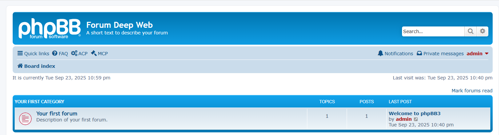
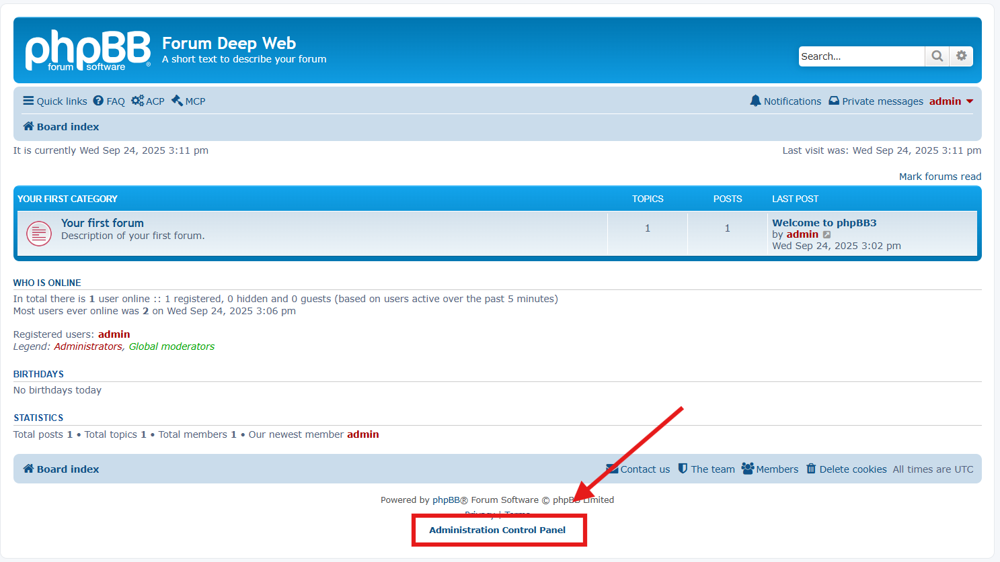
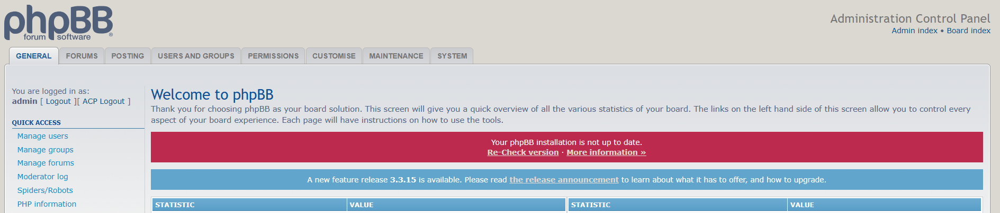

# 5/5 - Installation de PhpBB3 sur Ubuntu 24 pour le domaine `forum.deepweb.com`

## Hypothèses
- Serveur Ubuntu 24 installé avec Apache, PHP et MySQL fonctionnels.
- phpMyAdmin disponible pour la gestion des bases de données.
- Adresse IP du serveur : `192.168.x.77` (à adapter).
- Dossier du site : `/var/www/html/forum.deepweb.com`.

---

## 1) Créer l’utilisateur MySQL et la base via phpMyAdmin

1. Ouvrir phpMyAdmin : `http://<IP_SERVEUR>/phpmyadmin`  
2. Aller dans l’onglet **"Utilisateurs"**.  
3. Cliquer sur **"Ajouter un utilisateur"**.  
   - Nom d’utilisateur : `forum.deepweb.com`  
   - Hôte : `localhost`  
   - Mot de passe : `test`  
4. Cocher **"Créer une base du même nom et accorder tous les privilèges"** si disponible.  
5. Vérifier que l’utilisateur dispose de tous les privilèges sur la base `forum.deepweb.com` (structure et données).  

---

## 2) Télécharger et installer PhpBB3

1. Télécharger la dernière version de PhpBB3 depuis le site officiel :
```bash
cd /tmp
wget https://download.phpbb.com/pub/release/3.3/3.3.11/phpBB-3.3.11.zip
sudo apt install unzip -y
unzip phpBB-3.3.11.zip
```

2. Copier les fichiers dans le dossier du site :
```bash
sudo cp -R phpBB3/* /var/www/html/forum.deepweb.com/
```

3. Donner les bons droits :
```bash
sudo chown -R www-data:www-data /var/www/html/forum.deepweb.com
```

4. Supprimer l'ancien fichier index.html :
```bash
sudo rm /var/www/html/forum.deepweb.com/index.html
```

À partir d'ici votre site est accessible à l'adresse

    http://<IP_SERVEUR>/forum.deepweb.com

Testez-le, mais ne faites pas l'installation.

---

## 6) Installation de PhpBB3 via le navigateur

1. Accéder à `http://forum.deepweb.com`.  
2. L’installateur PhpBB3 se lance automatiquement.  
3. Cliquez sur l'onglet "INSTALL" et bouton "Install"
   - Check requirements
     - Administrator username:`admin`
     - Contact email address:`admin@forum.deepweb.com`
     - Administrator password:`Test_123`
     - Database server hostname or DSN: `localhost`
     - Database server port: Leave this blank
     - Database username : `forum.deepweb.com`
     - Database password: `test`
     - Database name: `forum.deepweb.com`
     - Prefix for tables in database: `phpbb_`
   - Server configuration: 
     - Ne rien modifier
   - Set installation data:
     - Ne rien modifier
   - Bulletin board configuration
     - Title of the board: Forum Deep Web
4. Laissez l'installation ser terminer.

---

## 7) Finalisation et sécurité

- Supprimer le dossier `install` après installation :
```bash
sudo rm -rf /var/www/html/forum.deepweb.com/install
```

- Vérifier que les droits appartiennent bien à `www-data` :
```bash
sudo chown -R www-data:www-data /var/www/html/forum.deepweb.com
```

---

## 8) Résultat attendu
Le site `http://forum.deepweb.com` héberge un forum PhpBB3 fonctionnel, connecté à la base `forum.deepweb.com`, accessible depuis un poste Windows du réseau local.


---

## 9) Accès à l'administration et test final

1. Accédez à l'URL `http://forum.deepweb.com/` depuis votre navigateur
2. Connectez-vous
    - Identifiant: `admin`
    - Mot de passe: `Test_123`
3. Cliquez sur `Administration Control Panel` en bas.

4. Naviguez dans l'interface de `Administration Control Panel` et ajoutez du contenu au forum.
