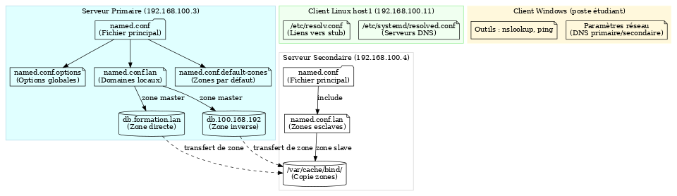

# Théorie sur les serveurs DNS et leurs fichiers de configuration

## 1) Introduction

Le **DNS (Domain Name System)** est le service qui traduit les noms de domaine en adresses IP et inversement.  
Sous Linux, l’implémentation la plus répandue est **BIND9 (Berkeley Internet Name Domain)**.  
BIND9 permet de mettre en place un serveur DNS primaire, secondaire ou un simple cache DNS.  

---

## 2) Les rôles des serveurs DNS

1) **Serveur primaire**  
   - Contient les fichiers de zone maîtres.  
   - Autorité sur les enregistrements.  
   - Les modifications s’effectuent ici.  

2) **Serveur secondaire**  
   - Récupère automatiquement les zones depuis le primaire.  
   - Sert de redondance et équilibre la charge.  

3) **Serveur de cache (hint)**  
   - Répond aux requêtes en consultant d’autres serveurs DNS.  
   - Garde les réponses en mémoire pour accélérer les requêtes suivantes.  

---

## 3) Structure des fichiers


---

## 4) Les fichiers de configuration de BIND9

Tous les fichiers principaux se trouvent dans `/etc/bind/`.

1) **named.conf**  
   - Fichier principal.  
   - Rassemble les autres fichiers de configuration par des instructions `include`.  

2) **named.conf.options**  
   - Définit les options globales du serveur DNS.  
   - Exemple : forwarders, écoute sur interfaces, sécurité.  
   ```text
   options {
       directory "/var/cache/bind";
       forwarders { 8.8.8.8; 8.8.4.4; };
       dnssec-validation auto;
       listen-on { any; };
       allow-query { any; };
   };
   ```

3) **named.conf.default-zones**  
   - Contient les zones par défaut utilisées pour la résolution de base.  
   - Exemples : localhost, 127.in-addr.arpa, root hints.  

4) **named.conf.lan**  
   - Fichier de configuration spécifique à votre domaine local.  
   - Déclare vos zones directes et inverses.  
   ```text
   zone "formation.lan" IN {
       type master;
       file "/etc/bind/db.formation.lan";
   };
   zone "x.168.192.in-addr.arpa" {
       type master;
       file "/etc/bind/db.x.168.192";
   };
   ```

5) **db.root**  
   - Liste les serveurs racine DNS sur Internet.  

6) **db.127 / db.0 / db.255**  
   - Zones inverses par défaut pour les adresses de loopback.  

7) **db.empty**  
   - Zone vide utilisée comme modèle.  

8) **zones.rfc1918**  
   - Définit les zones inverses des plages d’adresses privées (RFC 1918).  

9) **db.formation.lan (zone directe)**  
   - Définit la correspondance noms → adresses IP.  
   - Exemple :  
   ```text
   $ORIGIN formation.lan.
   @   IN  SOA primaire. root.primaire. (
           20221013 ; Serial
           604800   ; Refresh
           86400    ; Retry
           2419200  ; Expire
           604800 ) ; Negative Cache TTL
   ;
   @       IN  NS  primaire.
   @       IN  A   192.168.x.3
   host1   IN  A   192.168.x.11
   host2   IN  A   192.168.x.12
   ```

10) **db.x.168.192 (zone inverse)**  
    - Définit la correspondance adresses IP → noms.  
    - Exemple :  
    ```text
    $ORIGIN x.168.192.in-addr.arpa.
    @   IN  SOA primaire. root.primaire. (
            20221018 ; Serial
            604800   ; Refresh
            86400    ; Retry
            2419200  ; Expire
            604800 ) ; Negative Cache TTL
    ;
    @   IN  NS  primaire.formation.lan.
    3   IN  PTR primaire.formation.lan.
    11  IN  PTR host1.formation.lan.
    12  IN  PTR host2.formation.lan.
    ```

11) **bind.keys / rndc.key**  
    - Clés utilisées pour la sécurité et le contrôle de BIND.  

---

## 5) Outils utiles

1) **dnsutils**  
   - Fournit les commandes `dig`, `nslookup`, etc.  
   - Installation :  
   ```bash
   sudo apt install dnsutils -y
   ```

2) **named-checkconf**  
   - Vérifie la syntaxe des fichiers de configuration.  

3) **named-checkzone**  
   - Vérifie la cohérence syntaxique d’un fichier de zone.  

---

## 6) Résumé du flux de configuration

1) Installer BIND9 et utilitaires.  
2) Configurer `/etc/bind/named.conf.options` pour les forwarders.  
3) Déclarer les zones dans `/etc/bind/named.conf.lan`.  
4) Créer les fichiers de zones directes et inverses (`db.formation.lan`, `db.x.168.192`).  
5) Vérifier avec `named-checkconf` et `named-checkzone`.  
6) Redémarrer le service :  
   ```bash
   sudo systemctl restart bind9
   ```
7) Tester la résolution avec `dig` et `nslookup`.  

