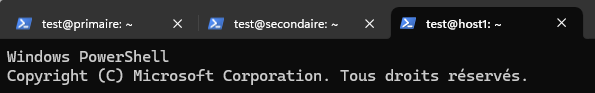

# 1/5 - Configuration de base pour serveurs DNS

## 1. Configurer un serveur DNS

Nous allons utiliser TROIS machines virtuelles Ubuntu.

Notre tâche sera de configurer ces deux machines en **serveur DNS primaire**, **serveur DNS secondaire** et **host1**.

### Configuration à utiliser
- Serveur primaire : `primaire.formation.lan` → **192.168.x.3/24**
- Serveur secondaire : `secondaire.formation.lan` → **192.168.x.4/24**
- host1 : `host1.formation.lan` → **192.168.x.11/24**

Création d'un domaine `formation.lan` avec les enregistrements :
- **SOA** : `ns1.formation.lan` et `root.ns1.formation.lan`
- **NS** : `ns1.formation.lan`
- **NS** : `ns2.formation.lan`
- **Glue Record**
- **A** et **PTR** : `windows.formation.lan 172.16.0.20`
- **CNAME** : `monpc.formation.lan windows.formation.lan`

Adaptez la procédure suivante selon votre réseau.

---

## 2 Préparation des machines virtuelles

1. Clônez votre VM de base « Ubuntu-clean » pour créer :  
   - `DNS-PRIMAIRE-U24`
   - `DNS-SECONDAIRE-U24`
   - `DNS-HOST1-U24`

2. Attribuez une **IP statique** à chaque VM.

3. Connectez-vous en SSH aux trois machines.
 

4. Changez les noms d’hôte en utilisant les commandes:  
   - Sur le serveur `primaire`
      ```bash
      sudo hostnamectl set-hostname primaire
      ```
   - Sur le serveur `secondaire`
      ```bash
      sudo hostnamectl set-hostname secondaire
      ```
   - Sur `host1`
      ```bash
      sudo hostnamectl set-hostname host1
      ```

À partir d'ici, `host1` est complètement configuré alors laissez le seulement fonctionner.

---

## 3 Installation sur  les serveurs `primaire` et `secondaire`

1. **Mettre à jour les serveurs `primaire` et `secondaire`:**
   ```bash
   sudo apt update && sudo apt upgrade -y
   ```

2. **Installer Bind9 et utilitaires :**
   ```bash
   sudo apt-get install bind9 bind9utils net-tools -y
   ```

3. **Redémarrer le service bind9 :**
   ```bash
   systemctl restart bind9
   # ou
   service bind9 restart
   ```

4. **Vérifier l’état du service :**
   ```bash
   systemctl status bind9
   ```

   Si le service est en état *Running*, vous pouvez poursuivre.

