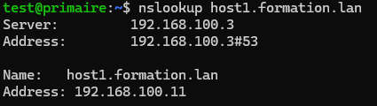
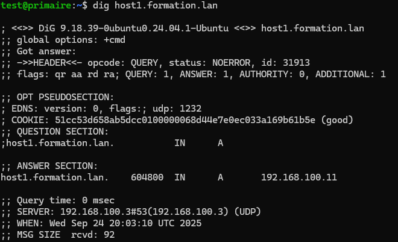
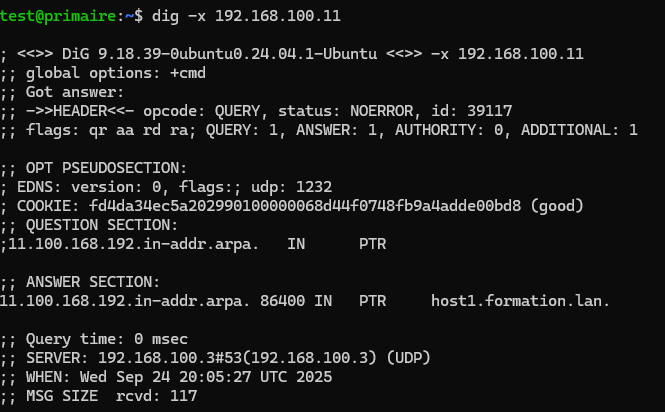
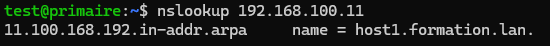

# 2/5 - Configuration du serveur DNS primaire

Nous allons configurer un **serveur DNS primaire** dans une architecture locale, ce qui est le cas le plus fréquent pour un réseau d’entreprise.  
Le domaine local choisi est `formation.lan`, installé sur une machine appelée `primaire` avec l’adresse IP `192.168.88.3/24`.

Le serveur « primaire » fera autorité sur cette zone et assurera la gestion du domaine.

---

## 1) Configuration de l’interface réseau

Assurez-vous que l’adresse IP statique est correctement configurée et fonctionne.

---

## 2) Hosts

Changez le nom de la machine si nécessaire :

```bash
sudo hostnamectl set-hostname primaire
```

Vérifiez et éditez le fichier `/etc/hosts` :

```text
127.0.0.1 localhost
127.0.1.1 primaire.formation.lan   primaire
```

⚠️ Le nom d’hôte doit être identique à celui déclaré dans le fichier `/etc/hosts`, sinon la configuration échouera.

---

## 3) Copier les fichiers de configuration d’origine

Éditez le fichier `/etc/bind/named.conf` et assurez-vous qu’il inclut les fichiers suivants :

```text
include "/etc/bind/named.conf.options";
include "/etc/bind/named.conf.lan";
include "/etc/bind/named.conf.default-zones";
```

---

## 4) Serveur de cache
Modifiez `/etc/bind/named.conf.options` pour configurer les forwarders (serveurs DNS de votre fournisseur Internet). 

Pour les connaitre, utilisez la commande `ipconfig /all` sur votre portable étudiant et trouvez les IP des serveurs DNS.

Par exemple :

```text
options {
    directory "/var/cache/bind";

    forwarders {
        10.20.8.51;
        10.20.8.55;
        8.8.8.8;
        8.8.4.4;
        1.1.1.1;
    };

    dnssec-validation auto;
    listen-on-v6 { any; };
    listen-on { any; };
    allow-query { any; };
};
```

Redémarrez Bind9 :

```bash
service bind9 restart
```

Le service ne démarre pas...

Cette erreur ce produit parce que vous n'avez pas le fichier `named.conf.lan` dans le dossier, si vous vérifiez, vous trouverez le fichier `named.conf.local`.

Renommez `named.conf.local` en `named.conf.lan`.

```text
sudo mv /etc/bind/named.conf.local /etc/bind/named.conf.lan
```

Redémarrez Bind9 :

```bash
service bind9 restart
```

Testez avec :

```bash
ping google.com
```

---

## 5) Définir les zones gérées par notre serveur DNS

Éditez `/etc/bind/named.conf.lan` et ajoutez les zones :

```text
zone "formation.lan" IN {
    type master;
    file "/etc/bind/db.formation.lan";
};

zone "x.168.192.in-addr.arpa" {
    type master;
    file "/etc/bind/db.x.168.192";
};
```
⚠️ Pensez à modifier la valeur de `x` pour votre réseau.

Supposons par exemple que nous gérons la zone directe formation.lan et la zone inverse x.168.192.in-addr.arpa.
Le nom de la zone inverse est construit en prenant l'identifiant réseau à l'envers et en ajoutant le suffixe .in-addr.arpa.

Ainsi, 192.168.x devient, x.168.192.

Pour chacune des zones, il faut définir son nom, indiquer s'il s'agit du serveur principal de la zone et indiquer le nom du fichier de zone correspondant. 

Les directives utilisées sont les suivantes :
- zone : nom de la zone
- type master : zone principale
- file : nom du fichier de zone (à placer dans le répertoire /etc/bind/)


---

## 6) Vérifier la syntaxe des fichiers de configuration

Exécutez :

```bash
named-checkconf
```

Si aucun message n’apparaît, la configuration est valide.

---

## 7) Compléter les fichiers de zones

### Zone directe : `formation.lan`

Créez le fichier `/etc/bind/db.formation.lan` :

```text
$ORIGIN formation.lan.
$TTL    604800
@       IN      SOA     primaire. root.primaire. (
                        20221013        ; Serial
                        604800          ; Refresh
                        86400           ; Retry
                        2419200         ; Expire
                        604800 )        ; Negative Cache TTL
;
@       IN      NS      primaire.
@       IN      A       192.168.x.3
host1   IN      A       192.168.x.11
host2   IN      A       192.168.x.12
host3   IN      A       192.168.x.13
```
⚠️ Pensez à modifier la valeur de `x` pour votre réseau.

`host1`,`host2` et `host3` pointent pour l'instant vers aucune VMs, ils sont là pour faire des tests.


Validez :

```bash
named-checkzone formation.lan /etc/bind/db.formation.lan
```

### Zone inverse : `x.168.192.in-addr.arpa`

Créez le fichier `/etc/bind/db.x.168.192` :

```text
$ORIGIN x.168.192.in-addr.arpa.
$TTL    86400
@       IN      SOA     primaire.formation.lan. root.formation.lan. (
                        20221018        ; Serial
                        604800          ; Refresh
                        86400           ; Retry
                        2419200         ; Expire
                        604800 )        ; Negative Cache TTL
;
@       IN      NS      primaire.formation.lan.
3       IN      PTR     primaire.formation.lan.
11      IN      PTR     host1.formation.lan.
12      IN      PTR     host2.formation.lan.
13      IN      PTR     host3.formation.lan.
```
⚠️ Pensez à modifier la valeur de `x` pour votre réseau.

Validez :

```bash
named-checkzone x.168.192.in-addr.arpa /etc/bind/db.x.168.192
```

---

## 8) Tester la configuration complète

Relancez Bind9 :

```bash
service bind9 restart
named-checkconf -z
```

---

## 9) Tester la résolution de nom

```bash
nslookup host1.formation.lan
```
Résultat attendu:



Ça ne fonctionne pas ?

Éditez `/etc/resolv.conf` pour pointer vers le serveur primaire.

Exemple :

```text
nameserver 192.168.x.3
```

Relancez Bind9 :

```bash
service bind9 restart
```

Continuez les tests

```bash
dig host1.formation.lan
```
Résultat attendu:


```bash
dig -x 192.168.x.11
```
Résultat attendu:


```bash
nslookup 192.168.x.11
```
Résultat attendu:



