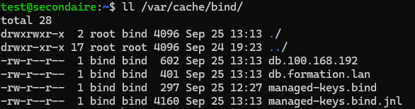

# 3/5 - Configuration du serveur DNS secondaire

Un serveur secondaire permet :  
- D’assurer la **disponibilité** du service en cas de panne du serveur primaire.  
- De répartir la **charge** des requêtes DNS.  

Le serveur secondaire réplique les zones gérées par le primaire et reste synchronisé grâce au mécanisme de transfert de zone.

---

## 1) Configuration de l’interface réseau

Attribuez une adresse IP fixe au serveur secondaire.  
Exemple : `192.168.100.4` pour `secondaire.formation.lan`.

---

## 2) Hosts

Renommez la machine :

```bash
sudo hostnamectl set-hostname secondaire
```

Modifiez `/etc/hosts` :

```text
127.0.0.1 localhost
127.0.1.1 secondaire.formation.lan   secondaire
```

---

## 3) Accès aux fichiers de configuration

Dans `/etc/bind/named.conf`, assurez-vous que ces includes existent :

```text
include "/etc/bind/named.conf.options";
include "/etc/bind/named.conf.lan";
include "/etc/bind/named.conf.default-zones";
```

---

## 4) Modifier le serveur primaire pour autoriser le secondaire

Sur le serveur **primaire** (ex. `192.168.100.3`), éditez `/etc/bind/named.conf.lan` :

```text
zone "formation.lan" IN {
    type master;
    file "/etc/bind/db.formation.lan";
    notify yes;
    allow-transfer { 192.168.100.4; };
};

zone "100.168.192.in-addr.arpa" {
    type master;
    file "/etc/bind/db.100.168.192";
    notify yes;
    allow-transfer { 192.168.100.4; };
};
```

Ajoutez dans `/etc/bind/db.formation.lan` :

```text
@       IN      NS      secondaire.
secondaire IN   A       192.168.100.4
```

Ajoutez dans `/etc/bind/db.100.168.192` :

```text
@       IN      NS      secondaire.formation.lan.
4       IN      PTR     secondaire.formation.lan.
```

Redémarrez Bind9 sur le primaire :

```bash
sudo service bind9 restart
```

---

## 5) Configurer le secondaire pour récupérer les zones

Sur le serveur **secondaire** (`192.168.100.4`), éditez `/etc/bind/named.conf.lan` :

```text
zone "formation.lan" {
    type slave;
    file "/var/cache/bind/db.formation.lan";
    masters { 192.168.100.3; };
};

zone "100.168.192.in-addr.arpa" {
    type slave;
    file "/var/cache/bind/db.100.168.192";
    masters { 192.168.100.3; };
};
```

---

## 6) Tester la configuration complète

1. Redémarrez Bind9 sur les deux serveurs :

```bash
sudo service bind9 restart
```

2. Vérifiez que les fichiers de zone sont répliqués dans `/var/cache/bind/` sur le secondaire.



3. Testez la résolution :

```bash
ping formation.lan
nslookup host1.formation.lan 192.168.100.4
```

Le serveur secondaire doit répondre correctement.


Si nécessaire, éditez `/etc/resolv.conf` pour pointer vers le serveur secondaire.

Exemple :

```text
nameserver 192.168.x.4
```

