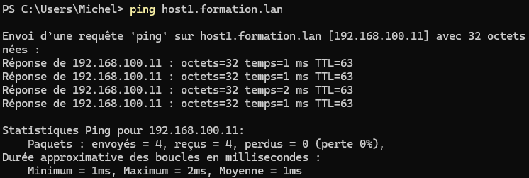
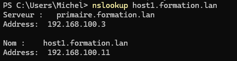
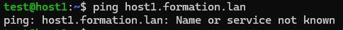
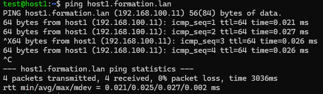

# 4/5 - Effectuer la configuration client DNS

Cette étape consiste à configurer les postes clients (Windows et Linux) pour qu’ils utilisent les serveurs DNS primaire et secondaire installés.

---

## 1) Sur un client Windows

1) Si le poste est en **DHCP**, les serveurs DNS sont fournis automatiquement.  
2) Pour tester, effectuez un `ping` vers un hôte de votre domaine :  
   ```cmd
   ping host1.formation.lan
   ```  
   Si cela échoue, configurez manuellement les serveurs DNS.  
3) Dans les paramètres réseau, attribuez en **DNS primaire** l’adresse `192.168.100.3` (serveur primaire) et en **DNS secondaire** l’adresse `192.168.100.4` (serveur secondaire).  
4) Tester de nouveau, effectuez un `ping` vers un hôte de votre domaine :
   ```cmd
   ping host1.formation.lan
   ```  

5) Vérifiez avec :  
   ```cmd
   nslookup host1.formation.lan
   ```

---

## 2) Sur un client Linux

1) Connectez-vous sur `host1`, une machine Ubuntu faisant partie du même réseau que vos serveurs DNS.  
2) Pour tester, effectuez un `ping` vers un hôte de votre domaine :
   ```cmd
   ping host1.formation.lan
   ```  
   Ce test échoue.


2) Éditez le fichier `/etc/systemd/resolved.conf` :  
   ```text
   [Resolve]
   DNS=192.168.100.3 192.168.100.4
   FallbackDNS=8.8.8.8 8.8.4.4
   ```  
3) Rechargez le service :  
   ```bash
   sudo systemctl restart systemd-resolved
   ```  
4) Vérifiez :  
   ```bash
   systemctl status systemd-resolved
   resolvectl status
   ```  
5) Testez la résolution de nom :  
   ```bash
   ping formation.lan
   ```
   Ce test fonctionne.

6) Pour tester, effectuez un `ping` vers un hôte de votre domaine :
   ```cmd
   ping host1.formation.lan
   ```  
   Ce test fonctionne.


---

## 3) Vérifier la prise en compte des modifications

1) Sur Linux, utilisez la commande : 
   ```bash
   resolvectl status
   ```  
   Vous devez voir vos serveurs `192.168.100.3` et `192.168.100.4` listés dans la section DNS Servers..  


4) Vérifiez qu’un `ping` ou un `nslookup` vers vos hôtes locaux fonctionne.  

---
