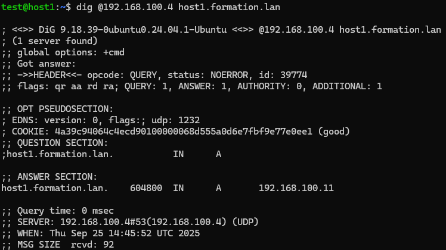
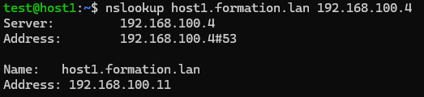
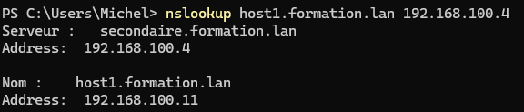

# 5/5 - Effectuer les tests DNS


Afin de valider la configuration, nous allons effectuer une série de tests depuis différents postes du réseau :  
- le serveur **primaire**  
- le serveur **secondaire**  
- un client Linux (**host1**)  
- un poste étudiant Windows  

Ces tests permettront de confirmer la résolution des noms, la cohérence des zones directes et inverses, et le fonctionnement des serveurs DNS.

---

## 2) Préparation

1) Installez l’outil `dnsutils` (sur Linux) si ce n’est pas déjà fait :  
```bash
sudo apt-get install dnsutils -y
```

2) Assurez-vous que les fichiers de zones ont été validés sur le serveur primaire avec :  
```bash
named-checkconf -z
```

3) Redémarrez le service bind9 sur chaque serveur :  
```bash
sudo service bind9 restart
```

---

## 3) Tests sur le serveur primaire (192.168.x.3)

1) Test de la **zone directe** :  
```bash
dig formation.lan
```

2) Test de la **zone inverse** :  
```bash
dig x.168.192.in-addr.arpa
```

3) Test résolution **nom → IP** :  
```bash
dig host1.formation.lan
nslookup host1.formation.lan
```

4) Test résolution **IP → nom** :  
```bash
dig -x 192.168.x.11
nslookup 192.168.x.11
```

5) Test résolution externe via forwarders :  
```bash
nslookup google.com
```

---

## 4) Tests sur le serveur secondaire (192.168.x.4)

1) Vérifiez que les zones sont bien répliquées :  
```bash
ls -l /var/cache/bind/
```

2) Test résolution **nom → IP** via le secondaire :  
```bash
dig @127.0.0.1 host1.formation.lan
nslookup host1.formation.lan 127.0.0.1
```

3) Test résolution **IP → nom** via le secondaire :  
```bash
dig @127.0.0.1 -x 192.168.x.11
nslookup 192.168.x.11 127.0.0.1
```

4) Test résolution externe :  
```bash
dig @127.0.0.1 google.com
```

---

## 5) Tests sur un client Linux (host1)

1) Vérifiez que les serveurs DNS sont pris en compte :  
```bash
resolvectl status
```

2) Test résolution **nom → IP** :  
```bash
ping formation.lan
dig host2.formation.lan
```

3) Test résolution **IP → nom** :  
```bash
dig -x 192.168.x.12
```

4) Test résolution externe :  
```bash
nslookup openai.com
```

5) Vérifiez que la requête passe bien par vos DNS :  
```bash
dig host1.formation.lan +trace
```

---

## 6) Tests sur un poste étudiant Windows

1) Vérifiez la configuration réseau :  
```cmd
ipconfig /all
```  
Vous devez voir `192.168.x.3` et `192.168.x.4` en DNS.

2) Test résolution **nom → IP** :  
```cmd
nslookup host1.formation.lan
ping host2.formation.lan
```

3) Test résolution **IP → nom** :  
```cmd
nslookup 192.168.x.11
```

4) Test résolution externe :  
```cmd
nslookup google.com
```

---

## 7) Tests complémentaires

1) Test de **tolérance de panne** :  
- Arrêtez le service bind9 sur le primaire :  
```bash
sudo systemctl stop bind9
```  
- Depuis host1 et Windows, testez une résolution de nom.  
Le secondaire doit répondre.
    - Depuis host1 (Linux) :
        ```bash
        dig @192.168.x.4 host1.formation.lan
        ```  

        ```bash
        nslookup host1.formation.lan 192.168.x.4
        ```

    - Depuis Windows (poste étudiant) :
        ```bash
        nslookup host1.formation.lan 192.168.x.4
        ```  


2) Test de **réplication dynamique** :  
- Ajoutez un nouvel enregistrement (ex. `host4`) dans le fichier de zone du primaire.  
- Redémarrez bind9 sur le primaire.  
- Vérifiez que le secondaire réplique la modification :  
```bash
dig @192.168.x.4 host4.formation.lan
```

3) Test de **performances** (optionnel) :  
- Mesurez le temps de réponse :  
```bash
time dig host1.formation.lan
```

---

Fin du chapitre **1) Effectuer les tests DNS**
