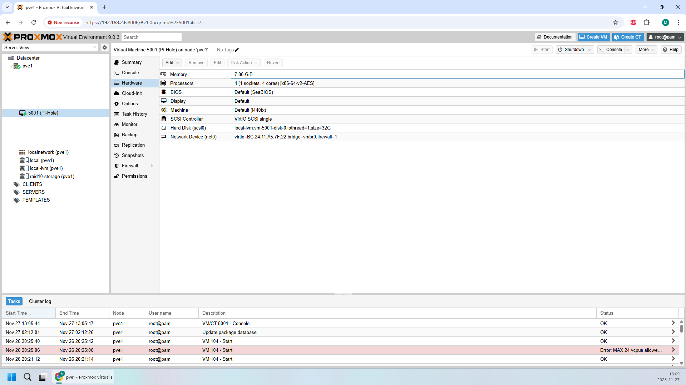

# 2.3 - Examen1 - evaluation_remise [20 %]

## Évaluation

À partir de votre projet GitHub « 3SK-VotreDA ».

- Créez le dossier `Examen1` et dans ce dossier, créez les sous-dossiers suivants ainsi que le contenu demandé.
- Vous pouvez joindre des captures d'écran dans les fichiers si elles sont utile.

### Critères d'évaluations

- Chaque fichiers demandés sera évalué selon la pertinence, l'organisation et la qualité de son contenu.
- Je me conserve le droit de me référer à vos VM sur Proxmox.

### ServeurDNS_PiHole [40 pts]

| Sous-dossier | Fichier                 | Description                                                                                                                                    | Points |
|:-------------|:------------------------|:-----------------------------------------------------------------------------------------------------------------------------------------------|:-------|
| **ServeurDNS_PiHole** | 0-proxmox.png           | Capture d'écran de votre VM dans Proxmox avec l'hardware affiché (la capture doit montrer tout l'écran)                                        | 2 pts  |
| **ServeurDNS_PiHole** | 1-installation.md       | Procédure d'installation complète et configuration du serveur fonctionnel. Ce fichier inclut les nom d'utilisateurs et mot de passe utilisés. | 15 pts |
| **ServeurDNS_PiHole** | 2-tests.md              | Tests et résultats prouvant que le serveur est fonctionnel et répond aux demandes.                                                                                     | 20 pts |
| **ServeurDNS_PiHole** | 3-local_dns_records.png | Capture d'écran de votre configuration DNS dans Pi-hole spécifique à l'examen 1 (la capture doit montrer tout l'écran)                         | 3 pts  |
|  |                         | **TOTAL**                                                                                                                                      | 40 pts |

#### Exemple 
0-proxmox.png

### ServeurWeb_LAMP [60 pts]

| Sous-dossier                    | Fichier           | Description                                                                                                                                   | Points |
|:--------------------------------|:------------------|:----------------------------------------------------------------------------------------------------------------------------------------------|:-------|
| **ServeurWeb_LAMP**             | 0-proxmox.png     | Capture d'écran de votre VM dans Proxmox avec l'hardware affiché (la capture doit montrer tout l'écran)                                       | 2 pts  |
| **ServeurWeb_LAMP**             | 1-installation.md | Procédure d'installation complète et configuration du serveur fonctionnel. Ce fichier inclut les nom d'utilisateurs et mot de passe utilisés. | 15 pts |
| **ServeurWeb_LAMP**             | 2-tests.md        | Tests et résultats prouvant que le serveur est fonctionnel et répond aux demandes.                                                            | 20 pts |
| **ServeurWeb_LAMP** | 3-phpmyadmin.md   | Fichier incluant **captures d'écrans** et explications montrant votre configuration PhpMyAdmin                                                | 10 pts |
| **ServeurWeb_LAMP**  | 4-wordpress.md    | Fichier incluant **captures d'écrans** et explications montrant votre configuration Wordpress et la fonctionnalité de votre site              | 13 pts |
|                                 |                   | **TOTAL**                                                                                                                                     | 60 pts |

#### Exemple
0-proxmox.png

## Remise

À partir de votre projet GitHub « 3SK-VotreDA » et votre Proxmox.
Remise: **17 décembre 2025 à minuit**