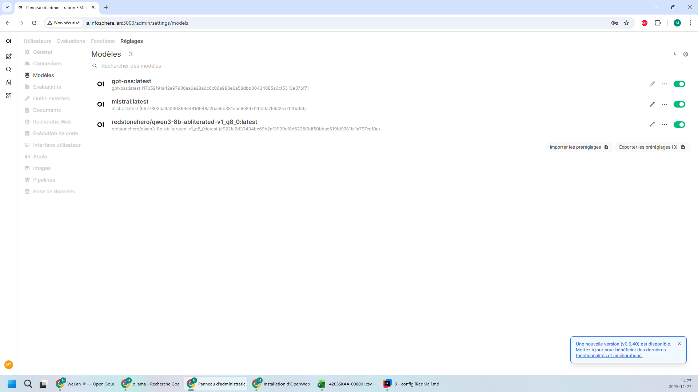

# 3.5 - ETC - evaluation_remise  [40 %]

## Évaluation 

À partir de votre projet GitHub « 3SK-VotreDA ».

- Créez le dossier `ETC` et dans ce dossier, créez les sous-dossiers suivants ainsi que le contenu demandé.
- Vous pouvez joindre des captures d'écran dans les fichiers si elles sont utile.

### Critères d'évaluations

- Chaque fichiers demandés sera évalué selon la pertinence, l'organisation et la qualité de son contenu.
- Je me conserve le droit de me référer à vos VM sur Proxmox.

### ServeurDNS_PiHole  [15 pts]

| Sous-dossier | Fichier                 | Description                                                                                                                                    | Points |
|:-------------|:------------------------|:-----------------------------------------------------------------------------------------------------------------------------------------------|:-------|
| **ServeurDNS_PiHole** | 2-tests.md              | Tests et résultats prouvant que le serveur est fonctionnel et répond aux demandes.                                                                                     | 10 pts |
| **ServeurDNS_PiHole** | 3-local_dns_records.png | Capture d'écran de votre configuration DNS dans Pi-hole spécifique à l'examen 1 (la capture doit montrer tout l'écran)                         | 5 pts  |
|  |                         | **TOTAL**                                                                                                                                      | 15 pts |

### ServeurMail_iRedMail  [45 pts]

| Sous-dossier                    | Fichier           | Description                                                                                                                                            | Points |
|:--------------------------------|:------------------|:-------------------------------------------------------------------------------------------------------------------------------------------------------|:-------|
| **ServeurMail_iRedMail**             | 0-proxmox.png     | Capture d'écran de votre VM dans Proxmox avec l'hardware affiché (la capture doit montrer tout l'écran)                                                | 2 pts  |
| **ServeurMail_iRedMail**             | 1-installation.md | Procédure d'installation complète et configuration du serveur fonctionnel. Ce fichier inclut les nom d'utilisateurs et mot de passe utilisés.          | 12 pts |
| **ServeurMail_iRedMail**             | 2-tests.md        | Tests et résultats prouvant que le serveur est fonctionnel et répond aux demandes.                                                                     | 15 pts |
| **ServeurMail_iRedMail** | 3-iredadmin.md   | Fichier incluant **captures d'écrans** et explications montrant votre configuration iredadmin                                                          | 8 pts  |
| **ServeurMail_iRedMail**  | 4-mail.md    | Fichier incluant **captures d'écrans** et explications montrant votre accès à Roundcube                                                                | 8 pts  |
|                                 |                   | **TOTAL**                                                                                                                                              | 45 pts |

#### Exemple
0-proxmox.png

### ServeurDocumentation_BookStack  [25 pts]

| Sous-dossier                    | Fichier              | Description                                                                                                                                   | Points |
|:--------------------------------|:---------------------|:----------------------------------------------------------------------------------------------------------------------------------------------|:-------|
| **ServeurDocumentation_BookStack**             | 0-proxmox.png        | Capture d'écran de votre VM dans Proxmox avec l'hardware affiché (la capture doit montrer tout l'écran)                                       | 2 pts  |
| **ServeurDocumentation_BookStack**             | 1-installation.md    | Procédure d'installation complète et configuration du serveur fonctionnel. Ce fichier inclut les nom d'utilisateurs et mot de passe utilisés. | 5 pts  |
| **ServeurDocumentation_BookStack**             | 2-tests.md           | Tests et résultats prouvant que le serveur est fonctionnel et répond aux demandes.                                                            | 7 pts  |
| **ServeurDocumentation_BookStack** | 3-docker-compose.yml | Le fichier de configuration de votre docker                                                                                                   | 2 pts  |
| **ServeurDocumentation_BookStack** | 4-nginx.conf         | Le fichier de configuration de votre docker                                                                                                   | 2 pts  |
| **ServeurDocumentation_BookStack** | 5-default.conf       | Le fichier de configuration de votre docker                                                                                                   | 2 pts  |
| **ServeurDocumentation_BookStack** | 6-phpmyadmin.md      | Fichier incluant **captures d'écrans** et explications montrant votre configuration PhpMyAdmin                                                | 1 pt   |
| **ServeurDocumentation_BookStack**  | 7-bookstack.md       | Fichier incluant captures d'écran et explications montrant votre configuration BookStack et le contenu créé (livre, chapitres, pages)         | 2 pts  |
| **ServeurDocumentation_BookStack**  | 8-logs.txt           | Copie de tout les logs de tous les services `docker compose logs -f`                                                                            | 2 pts  |
|                                 |                      | **TOTAL**                                                                                                                                     | 25 pts |

#### Exemple
0-proxmox.png

### ServeurIA_OpenWebUI  [15 pts]

| Sous-dossier                    | Fichier             | Description                                                                                                                                   | Points |
|:--------------------------------|:--------------------|:----------------------------------------------------------------------------------------------------------------------------------------------|:-------|
| **ServeurIA_OpenWebUI**             | 0-proxmox.png       | Capture d'écran de votre VM dans Proxmox avec l'hardware affiché (la capture doit montrer tout l'écran)                                       | 2 pts  |
| **ServeurIA_OpenWebUI**             | 1-installation.md   | Procédure d'installation complète et configuration du serveur fonctionnel. Ce fichier inclut les nom d'utilisateurs et mot de passe utilisés. | 4 pts  |
| **ServeurIA_OpenWebUI**             | 2-tests.md          | Tests et résultats prouvant que le serveur est fonctionnel et répond aux demandes.                                                            | 5 pts  |
| **ServeurIA_OpenWebUI** | 3-openwebui.md      | Fichier incluant **captures d'écrans** et explications montrant que votre IA est fonctionnel.                                                 | 2 pts  |
| **ServeurIA_OpenWebUI**  | 4-administration.md | Fichier incluant **captures d'écrans** et explications montrant le modèle dans le panneau de configuration (/admin/settings/general)          | 2 pts  |
|                                 |                     | **TOTAL**                                                                                                                                     | 15 pts |

#### Exemple
0-proxmox.png

4-administration.md

## Remise

À partir de votre projet GitHub « 3SK-VotreDA » et votre Proxmox.
Remise: **17 décembre 2025 à minuit**