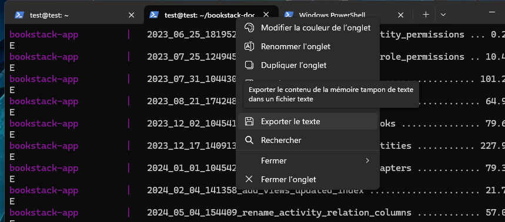

# Procédure pour effectuer une sauvegarde de texte via Terminal

## 1 - Nettoyage de l'écran
Dans la fenêtre ssh, utilisez cette commande.

```
clear
```

## 2 - Exportation du texte



## 3 - Enregistrement

Enregistrez-le où vous voulez en le nommant correctement.