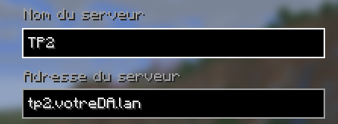

# 2/4 - TP2 - Tâches

Voici l'idée générale:

Votre réseau utilisera deux serveurs de DNS ainsi qu'un serveur Minecraft accessible par vos utilisateurs connecté sous Windows via l'adresse `tp2.votreDA.lan` où `votreDA` est remplacé par le vôtre par exemple « tp2.12345678.lan ».

Votre travail consiste à configurer votre parc de serveurs pour qu'il soit possible via votre portable étudiant de se connecter au serveur Minecraft via l'adresse  `tp2.votreDA.lan` sans utiliser l'adresse IP du serveur.

Voici les caractéristiques des trois serveurs:

| Type de serveur | Nom de l'hôte | IP              |
|:--------------|:--------------|:----------------|
|DNS primaire|tp2primaire| 192.168.*x*.100 |
|DNS secondaire|tp2secondaire| 192.168.*x*.101 |
|Minecraft|tp2minecraft| 192.168.*x*.42  |

Où *x* est votre propre réseau.

Libre à vous d'utilisez vos serveurs déjà configurés, mais ils devront répondrent aux demandes exigés.

Je vous conseil de partir de zéro pour les DNS primaire et secondaire en vous basant sur ce que vous avez déjà fait.

Vous devez corriger les erreurs rencontrées dans les différents tests effectués lors de la `configuration` et lors de la `documentation`.

