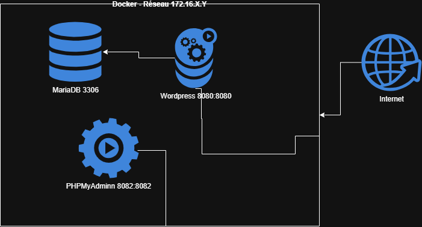

# Laboratoire Docker - Wordpress

## Adaptations :

### 1. Utilisez une adresse IP fixe de classe B avec un masque de sous-réseau pour avoir le nombre minimal de machine dans le réseau. (i.e: `192.168.0.1/24`).

### 2. Utilisez le fichier `.env` pour stocker tout ce qui peut changer entre deux (2) configurations (adresse ip, mot de passe, noms d'hôtes etc...).

### 3. Ajustez le fichier de configuration de `PHP` pour authoriser les téléversement de plus de `80MB`

### 4. Instancier un deuxième `Wordpress` sur le port externe `8081` qui utilise la même base de données.

### 5. `BONUS` Installez une instance de `Prometheus` (et son plugin wordpress) pour faire une surveillance des installations de `Wordpress`.

