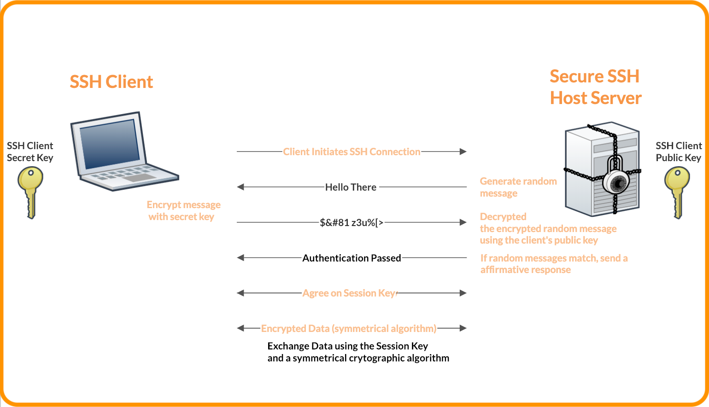

# Théorie — SSH, clés publiques et authentification sans mot de passe

**Cours :** Réseaux et systèmes
**Public cible :** Étudiants en informatique
**Durée estimée :** 60 minutes

---

## 1. Introduction au protocole SSH

SSH (**Secure Shell**) est un protocole sécurisé utilisé pour administrer des systèmes à distance.
Il remplace les anciens protocoles **telnet** ou **rlogin**, qui n’offraient aucune confidentialité.

SSH assure trois fonctions essentielles :
1. **Confidentialité** – toutes les données sont chiffrées.
2. **Authenticité** – le serveur et le client s’identifient mutuellement.
3. **Intégrité** – les données ne peuvent pas être modifiées en transit.

---

## 2. Méthodes d’authentification

| Méthode               | Description                                              | Niveau de sécurité |
|-----------------------|----------------------------------------------------------|--------------------|
| Mot de passe          | L’utilisateur saisit son mot de passe à chaque connexion | Moyenne            |
| Clé publique / privée | Le client prouve son identité avec une clé privée        | Élevée             |
| Agent SSH             | La clé est déverrouillée une fois et réutilisée          | Très élevée        |

**Avantage principal :** aucune transmission de mot de passe sur le réseau.

---

## 3. Les paires de clés SSH

Une paire de clés contient deux fichiers générés ensemble :

| Élément      | Fichier                          | Rôle                |
|--------------|----------------------------------|---------------------|
| Clé privée   | `id_ed25519` ou `id_rsa`         | Doit rester secrète |
| Clé publique | `id_ed25519.pub` ou `id_rsa.pub` | Peut être partagée  |

### Processus d’authentification
1. Le client envoie sa **clé publique** au serveur.
2. Le serveur la conserve dans `~/.ssh/authorized_keys`.
3. Lors de la connexion, le serveur envoie un **défi**.
4. Le client le signe avec sa **clé privée**.
5. Le serveur vérifie la signature avec la clé publique.
6. Si la signature est valide → connexion acceptée sans mot de passe.

---

## 4. Types de clés et algorithmes

| Type    | Caractéristiques                   | Recommandation       |
|---------|------------------------------------|----------------------|
| RSA     | Ancien standard, jusqu’à 4096 bits | Acceptable mais lent |
| ED25519 | Moderne, rapide et sécurisé        | Recommandé           |
| ECDSA   | Courbes elliptiques, moins courant | Optionnel            |

**ED25519** est aujourd’hui le meilleur choix : plus sûr, plus rapide et plus court.

---

## 5. Le dossier `.ssh`

Chaque utilisateur possède un dossier `~/.ssh` contenant :

| Fichier                          | Description                                         |
|----------------------------------|-----------------------------------------------------|
| `id_ed25519` ou `id_rsa`         | Clé privée (secrète)                                |
| `id_ed25519.pub` ou `id_rsa.pub` | Clé publique (diffusable)                           |
| `authorized_keys`                | Liste des clés publiques autorisées (serveur)       |
| `known_hosts`                    | Liste des serveurs connus (client)                  |
| `config`                         | Fichier de configuration simplifiant les connexions |

### Permissions minimales
- `~/.ssh` → 700
- `id_*` → 600
- `authorized_keys` → 600
- `known_hosts` et `config` → 644

SSH refusera la connexion si ces permissions sont trop ouvertes.

---

## 6. Le fichier `~/.ssh/config`

Exemple :

```
Host serveur1
    HostName 192.168.0.10
    User admin
    Port 22
    IdentityFile ~/.ssh/id_ed25519
    IdentitiesOnly yes
```

Permet de remplacer :
```bash
ssh -p 22 admin@192.168.0.10 -i ~/.ssh/id_ed25519
```
par simplement :
```bash
ssh serveur1
```

**Avantages :**
- Gain de temps.
- Moins d’erreurs humaines.
- Automatisation simplifiée.

---

## 7. L’agent SSH (`ssh-agent`)

`ssh-agent` conserve la clé déverrouillée en mémoire afin d’éviter de retaper la passphrase à chaque connexion.

### Commandes essentielles
```bash
eval "$(ssh-agent -s)"
ssh-add ~/.ssh/id_ed25519
```

Sous Windows (PowerShell) :
```powershell
Start-Service ssh-agent
ssh-add "$env:USERPROFILE\.ssh\id_ed25519"
```

---

## 8. Bonnes pratiques de sécurité

- Utiliser des clés **ED25519** protégées par passphrase.
- Vérifier régulièrement le contenu de `authorized_keys`.
- Ne jamais partager la clé privée.
- Ne pas désactiver la vérification d’hôte (`StrictHostKeyChecking`).
- Restreindre les accès dans `authorized_keys` :
  ```
  from="192.168.0.*",no-port-forwarding ssh-ed25519 AAAA... commentaire
  ```

---

## 9. Flux complet de l’authentification SSH

```text
1. Le client contacte le serveur SSH.
2. Le serveur envoie sa clé d’hôte.
3. Le client la vérifie dans known_hosts.
4. Le serveur envoie un défi.
5. Le client le signe avec sa clé privée.
6. Le serveur valide avec la clé publique.
7. Si la signature est correcte, la connexion est établie.
```

---

## 10. Comparaison mot de passe / clé publique

| Critère          | Mot de passe                 | Clé publique        |
|------------------|------------------------------|---------------------|
| Sécurité         | Moyenne                      | Élevée              |
| Facilité d’usage | Saisie requise à chaque fois | Automatique         |
| Automatisation   | Difficile                    | Facile              |
| Risque principal | Vol de mot de passe          | Perte de clé privée |

---

## 11. Erreurs fréquentes et solutions

| Message d’erreur                | Cause probable                   | Solution                                      |
|---------------------------------|----------------------------------|-----------------------------------------------|
| `Permission denied (publickey)` | Mauvaises permissions sur `.ssh` | Vérifier `chmod 700/600`                      |
| `Host key verification failed`  | Empreinte d’hôte modifiée        | Supprimer l’entrée fautive dans `known_hosts` |
| `Connection refused`            | SSH non actif sur le serveur     | Vérifier `systemctl status ssh`               |

---

## 12. Schéma récapitulatif


---

## 13. En résumé

- SSH garantit **confidentialité**, **intégrité** et **authentification**.
- Les clés **ED25519** sont à privilégier.
- Le fichier `~/.ssh/config` simplifie les connexions.
- `ssh-agent` permet d’éviter la répétition des passphrases.
- Une bonne gestion des permissions est cruciale.

---

# Tableau récapitulatif synthèse

| Élément           | Localisation     | Rôle                           | Permissions |
|-------------------|------------------|--------------------------------|-------------|
| `id_ed25519`      | Client           | Clé privée (secrète)           | 600         |
| `id_ed25519.pub`  | Client / Serveur | Clé publique (diffusable)      | 644         |
| `authorized_keys` | Serveur          | Liste des clés autorisées      | 600         |
| `known_hosts`     | Client           | Empreintes des serveurs connus | 644         |
| `config`          | Client           | Fichier de configuration SSH   | 644         |

---
